# Unity Game Development Summary

| Field | Detail |
|---|---|
| **Name** |Courier Chaos|
| **Student Name(s)** | Bryan H|
| **Class / Course** | Courier Chaos|
| **Repository** | https://github.com/TempeHS/2026CT_GameDesign_CourierChaos_Bryan.H|
| **Unity Version** |6000.0.58f1|
| **Document Version** | v0.1|
| **Date** | 27/08/26|

---

## Table of Contents
1. [Game Overview](#1-game-overview)
2. [Video Walkthrough](#2-video-walkthrough)
3. [Game Mechanics](#3-game-mechanics)
4. [Visual Features](#4-visual-features)
5. [Audio Design](#5-audio-design)
6. [User Interface & HUD](#6-user-interface--hud)
7. [Scene & Level Design](#7-scene--level-design)
8. [Scripts & Programming](#8-scripts--programming)
9. [Development Techniques & Tutorials Acknowledged](#9-development-techniques--tutorials-acknowledged)
10. [Third-Party Content Acknowledgements](#10-third-party-content-acknowledgements)
11. [Challenges & Solutions](#11-challenges--solutions)
12. [Branch Development Summary](#12-branch-development-summary)

---

## 1. Game Overview

### 1.1 Genre
2d Platformer

### 1.2 Target Audience
Ages 7-15

### 1.3 Game Summary
Courier Chaos is a 2D platform action game where the player takes on the role of a courier. The aim is to travel through the level, collect parcels, talk to NPCs, and make it to the end of the route. I wanted the movement to feel quick and satisfying, so the player can jump, air-jump, dash, slide, and use walls to move around the level.

### 1.4 Win / Loss Conditions
| Condition | Description |
|---|---|
| Win |Reaching the end of the route and completing the level. The exact finish trigger depends on the scene. |
| Loss |Falling into a death zone or leaving the playable area. If a checkpoint has been activated, the player returns to it. |

### 1.5 Platform & Build Settings
| Setting | Detail |
|---|---|
| Target Platform | PC |
| Resolution |Any 16:9 Aspect Ratio |
| Build Type |Windows PC (exact architecture should be confirmed in Unity Build Settings) |

---

## 2. Video Walkthrough

### 2.1 Full Gameplay Walkthrough

  

 

| Field | Detail |
|---|---|
| **Bryan Huang Courier Chaos** | |
| **https://youtu.be/sEFqQlF8fIc** | |
| **1:54** | |
| **2026 CT T3 Tempe HS** | |

### 2.2 Feature Highlight Clips

| Clip | Description | Timestamp In video  |
|---|---|---|
| Main Menu | Demonstration of the main menu| 0:04 - 0:17 |
| Dialouge System | Demo of the dialouge system | 0:18 - 0:25 |
| Player Pickup| Pickup system| 0:28 - 0:30 |
| Both Menus |Showcases both help menu and main pause menu | 0:31 - 0:40 |
| Out of Bounds|Showcases the out of bounds system | 0:41 - 0:44 |
| Parallax and Jumping/walking effects| Demonstration of the ininite parallax and Sound effects |0:45 - 0:49 |
| Air jumps and wall climb| Highlights some more radical features of added movement|0:50-0:53 |
|Coyote jump and CSGO insipired movement implimentation |Added aspects of semi-linear movement |0:53 - 0:56 |
|BGM | Sourcing BGM music |0:57 - 1:00 |
|NPC showcase | Highlighting the UI and text elements of NPC and the interact detection system| 1:01 - 1:19|
|Checkpoint showcase |Demonstrating the savepoint and how it differs from out of bounds |1:20 - 1:43 |

---

## 3. Game Mechanics

### 3.1 Core Mechanics
| ID | Mechanic | Description | Implemented In (Script/Object) |
|---|---|---|---|
| M-1 | Movement and acceleration | The player accelerates up to a maximum speed. Ground and air movement use different acceleration values, with friction slowing the player down. | `PlayerMovement.cs` |
| M-2 | Jumping | The player can jump from the ground and perform up to three air jumps. Coyote time and jump buffering make the controls feel more forgiving. | `PlayerMovement.cs` |
| M-3 | Dash and slide | The dash gives the player a quick burst of movement, while the slide lets them keep moving quickly along the ground. | `PlayerMovement.cs` |
| M-4 | Wall movement | The player can slide down walls and jump away from them when wall movement is enabled. | `PlayerMovement.cs` |
| M-5 | Parcels and checkpoints | Parcels disappear when collected, and checkpoints save the player’s position for respawning. | `ParcelController.cs`, `Checkpoint.cs`, `DeathZone.cs` |
| M-6 | NPC interaction | An icon appears near an NPC, allowing the player to interact and read dialogue with names and portraits. | `InteractionDetector.cs`, `NPC.cs`, `NPC Dialouge.cs` |

### 3.2 Player Controls
| Action | Input (Keyboard / Controller) | Description |
|---|---|---|
| Jump | Space Bar / configured `Jump` input | Ground jump plus up to three air jumps. |
| Move left/right | A/D or arrow keys | Horizontal movement with acceleration and friction. |
| Dash | Configured `Fire3` input | A short directional burst; one air dash is available before landing. |
| Slide | Configured `Fire1` input or S | A short ground slide that preserves forward momentum. |
| Interact | Input System `Interact` action | Interacts with a nearby NPC or other `IInteractable` object. |
| Pause | Tab | Opens or closes the pause menu. |
| Tips | H | Opens or closes the tips panel. |

### 3.3 Physics & Collision
| Feature | Description |
|---|---|
| Rigidbody2D movement | The player uses Unity’s 2D physics system, with movement updated in `FixedUpdate`. |
| Ground and wall checks | OverlapCircle checks detect the ground; raycasts detect left and right walls. |
| Collision triggers | Trigger colliders are used for parcels, checkpoints, death zones, out-of-bounds areas, and NPC interaction ranges. |
| Respawning | `DeathZone` returns the player to the static checkpoint position when available. |

### 3.4 Game Loop
| Stage | Description |
|---|---|
| Start / Initialisation | The start menu loads the scene named `Main`. The player also creates the ground and wall checks automatically if they are missing. |
| Core Loop | The player moves through the level, collects parcels, activates checkpoints, and talks to NPCs while avoiding hazards. |
| Win / End State | The repository scripts do not contain a universal win-condition controller; the finish behaviour is configured by the scene. |
| Restart | Death zones respawn the player at the last checkpoint. A full scene restart can be configured through Unity scene/build settings. |

### 3.5 Scoring & Progression
| Element | Description |
|---|---|
| Scoring System | There is currently no score counter. Parcels are collected as part of the level objective. |
| Difficulty Progression | Difficulty is created through platforming hazards, gaps, walls, out-of-bounds areas, and the level layout. |
| Unlockables / Levels | No unlock system is implemented in the inspected scripts. The start menu loads the `Main` scene. |

---

## 4. Visual Features

**Parallax** – The background moves at a different speed from the player, which gives the level more depth.

**Repeating background** – The background can repeat as the player explores, so one extremely large image is not needed.

**Clear sprites** – Keeping the images high quality helps the sprites stay sharp when viewed up close.

### 4.1 Particle Effects

| Effect Name | Purpose | Screenshot |
|---|---|---|
|N/A |N/A |N/A |

---

### 4.2 Cut Scenes & Cinematics

| Cut Scene | Trigger | Description | Screenshot / Still |
|---|---|---|---|
| N/A| N/A| N/A|N/A |

---

### 4.3 Animations

| Animation | Object / Character | Description | Screenshot |
|---|---|---|---|
| Walking | Player character | The walking animation uses the sprite animation in `Assets/Animations/walk.anim`. (broken) | 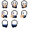|
| Idle Down | Player character | The idle animation is stored in `Assets/Animations/Idle Down.anim`. |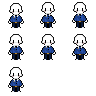 |
| Jump / Dash / Slide | Player character | The movement script changes the Animator state when the player jumps, dashes, walks, or slides. (Broken)|  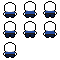 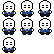|

 

---

### 4.4 Lighting & Post-Processing

| Feature | Description | Screenshot |
|---|---|---|
| N/A|N/A | N/A|

---

### 4.5 Shaders & Materials

| Shader / Material | Applied To | Description | Screenshot |
|---|---|---|---|
| N/A| N/A| N/A|N/A |

---

### 4.6 Additional Visual Screenshots

| Description | Screenshot |
|---|---|
| Clean Dialouge| 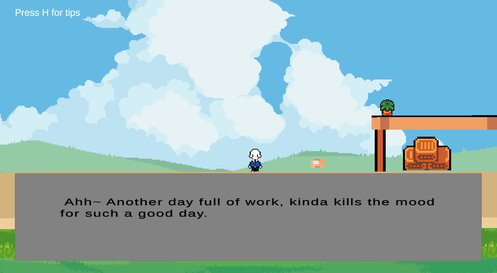 |
| NPC Interaction|  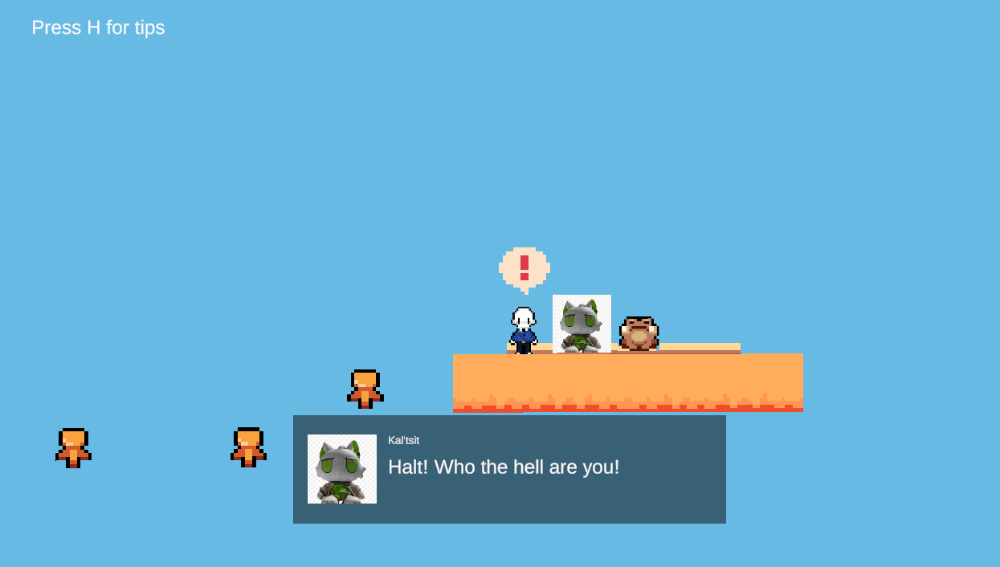 |

---

## 5. Audio Design

### 5.1 Music
| Track | Scene / Trigger | Source / Composer |
|---|---|---|
| `Courier Chaos BGM.MP3` | Background music asset available in `Assets/Audio`. ; BGM for game | Mix of tracks from Yu-Peng Chen's music from Genshin Impact |
| `0921.MP3` | Audio asset available in `Assets/Audio`; Used as sound effects for walking | By Minecraft |
| `TheFatRat_-_Xenogenesis_(mp3.pm).mp3` | Audio asset available in `Assets/Audio`; Used In the Main menu . | TheFatRat, Royalty free "Xenogenisis" |
| `skyrim-npc-music-harvest-dawn.mp3` | Audio asset available in `Assets/Audio`; For dialouge bgm, Did not fully work| Skyrim's Sound |

### 5.2 Sound Effects
| Sound Effect | Trigger | Source |
|---|---|---|
| Jump sound | Plays when the player jumps or wall-jumps. | `PlayerMovement.jumpSound` |
| Walking sound | Plays while the player is moving on the ground and stops when they become idle, airborne, dashing, or sliding. | Minecraft's Sound effects |
| Checkpoint sound | Plays the first time a checkpoint is activated. `slap-soundmaster13-49669815_4L20wGP.mp3` action_jump is used for jumping sound effects and slap is for the notification of reaching a checkpoint. | `Checkpoint.checkpointSound` - SoundEffects|
| Other imported effects | `action_jump.mp3` in `Assets/Audio`; action_jump is used for jumping sound effects and slap is for the notification of reaching a checkpoint. | Roblox |

### 5.3 Audio Implementation
| Feature | Description |
|---|---|
| Audio Mixer / Groups | No custom mixer implementation is visible in the inspected scripts. Audio is assigned through Unity `AudioSource` components. |
| Spatial / 3D Audio | No custom spatial-audio logic is visible in the inspected scripts. |
| Dynamic Audio | Walking, jumping, and checkpoint audio are triggered by gameplay state/events. |

---

## 6. User Interface & HUD

### 6.1 HUD Elements
| Element | Purpose | Screenshot |
|---|---|---|
| Velocity display | Shows the player’s horizontal velocity, vertical velocity, and overall speed using TextMesh Pro. (Does not work) |N/A |
| Interaction icon | Lets the player know when they are close enough to interact with an NPC or object. |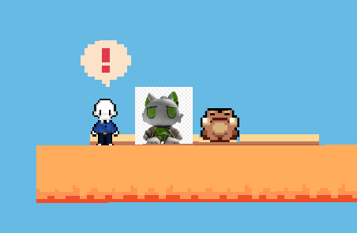 |
| Dialogue panel | Shows the NPC’s name, portrait, and dialogue one character at a time. | 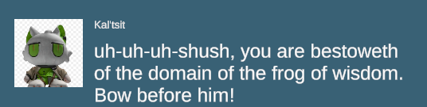|

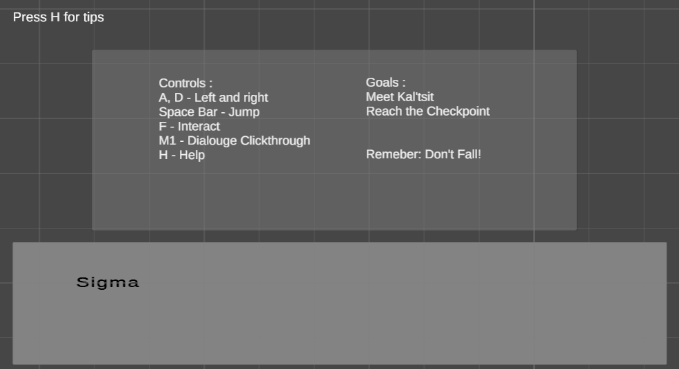

### 6.2 Menus
| Menu | Purpose | Screenshot |
|---|---|---|
| Main Menu | Starts the `Main` scene and provides an exit button. | 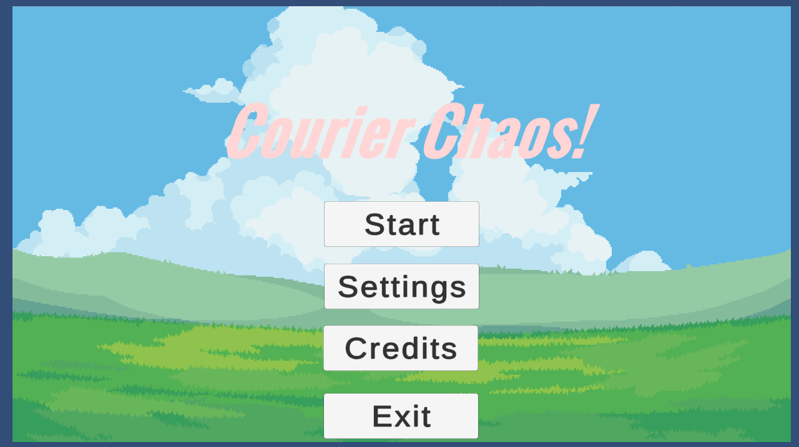|
| Pause Menu | Toggled with Tab and controlled through `PauseController`. |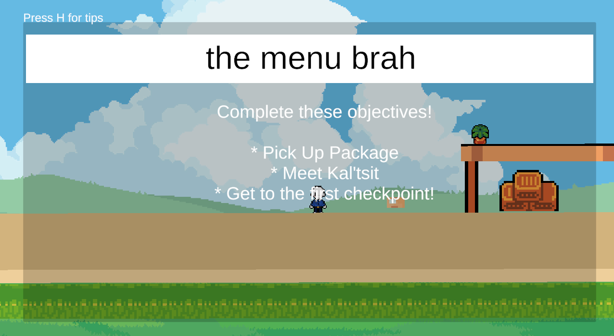 |
| Tips Screen | Toggled with H through `TipsMenuController`. |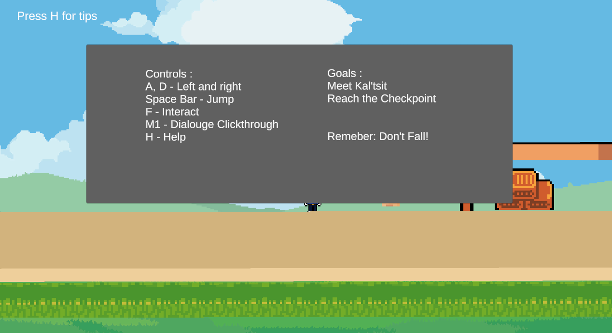 |
| Dialogue Menu | Pauses gameplay while NPC dialogue is active. |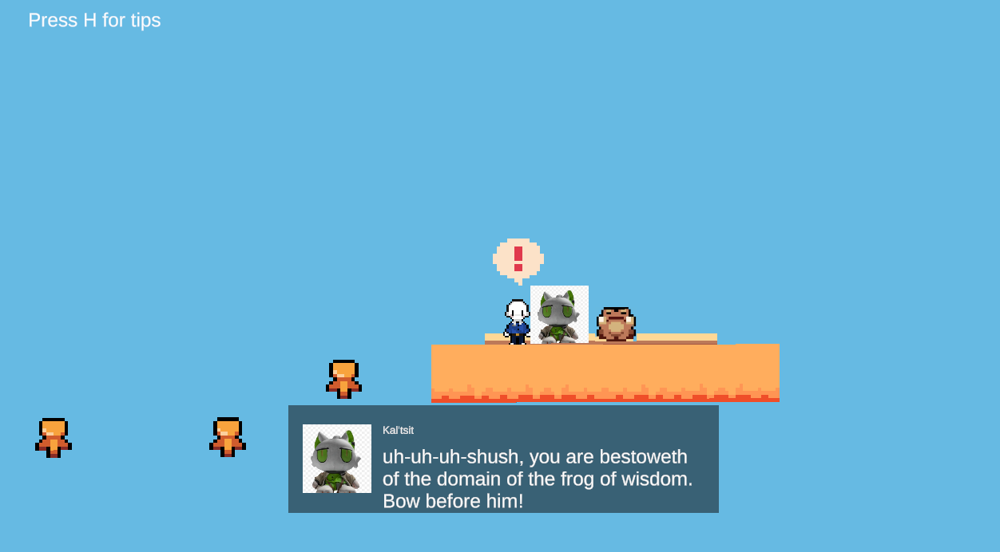 |
| Game Over Screen | No dedicated game-over controller is present in the inspected scripts. | N/A|

---

## 7. Scene & Level Design

### 7.1 Scene List
| Scene Name | Purpose | Description |
|---|---|---|
| Main | Gameplay scene loaded by the start menu. | The scene name is referenced by `StartMenuController`; its scene file is not committed in the inspected repository files. |
| Start menu scene | Main-menu entry point. | The exact scene name is configured through Unity scene/build settings and is not referenced by script. |

### 7.2 Level / Environment Screenshots
| Level / Area | Description | Screenshot |
|---|---|---|
|1 |A strange area without many people, it seems like whoever our courier is delivering to likes to be alone. | 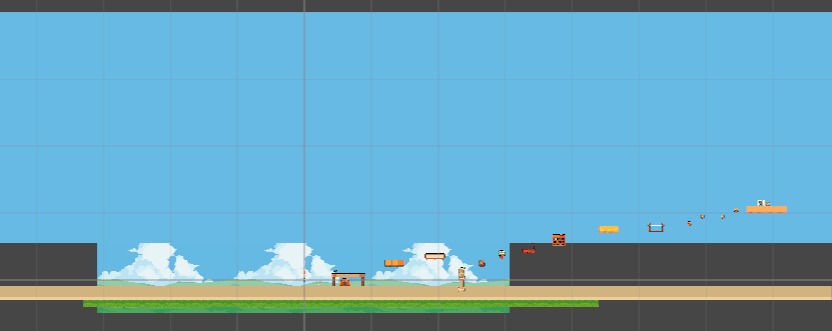|

### 7.3 Scene Management
| Feature | Description |
|---|---|
| Scene Loading Method | `SceneManager.LoadScene("Main")` is used by `StartMenuController`. |
| Persistent Data Between Scenes | `Checkpoint.savedPosition` is static and can persist while the application remains running. |
| Scene Transition Effects | `ScreenFader` provides coroutine-based fade-to-black and fade-from-black transitions for out-of-bounds teleporting. |

---

## 8. Scripts & Programming

### 8.1 Script Summary
| Script Name | Attached To | Responsibility |
|---|---|---|
| `PlayerMovement.cs` | Player | Rigidbody2D movement, jumping, air jumps, dash, slide, wall slide/jump, animation, and movement audio. |
| `ParcelController.cs` | Parcel | Destroys a parcel when it enters a trigger with the Player tag. |
| `Checkpoint.cs` / `DeathZone.cs` | Checkpoint / hazard | Saves a checkpoint position and respawns the player after death. |
| `Parallax.cs` | Background sprite | Moves and wraps background sprites relative to the camera. |
| `NPC.cs`, `NPC Dialouge.cs`, `InteractionDetector.cs`, `IInteractable.cs` | NPC / player interaction | Provides interactable objects, NPC dialogue data, dialogue UI, and interaction detection. |
| `DIALOGUE.cs` | Dialogue UI | Types dialogue lines and temporarily freezes player movement. |
| `MenuController.cs`, `PauseController.cs`, `StartMenuController.cs`, `TipsPopup.cs`, `ExitButton.cs` | UI/menu objects | Controls pause, start, tips, scene loading, and quitting. |
| `FadeBehaviour.cs`, `OutOfBounds.cs` | Screen/UI and hazard | Fades the screen and teleports the player when leaving the playable area. |
| `VelocityDisplay.cs` | HUD | Displays the player Rigidbody2D velocity and speed. |

### 8.2 Key Algorithms / Logic
| Feature | Script | Description |
|---|---|---|
| Buffered/coyote-time jumping | `PlayerMovement.cs` | A short jump buffer accepts early input and coyote time allows a jump shortly after leaving a platform. |
| Accelerated platform movement | `PlayerMovement.cs` | Ground and air acceleration, friction, speed caps, and directional facing create responsive movement. |
| Respawn checkpoint system | `Checkpoint.cs`, `DeathZone.cs` | A static position is saved on checkpoint activation and reused after entering a death zone. |
| Infinite parallax background | `Parallax.cs` | Background position is offset by camera movement and wrapped when it reaches its sprite length. |
| Typewriter dialogue | `NPC.cs`, `DIALOGUE.cs` | Dialogue is revealed one character at a time and can be advanced or completed by the player. |

### 8.3 Design Patterns Used
| Pattern | Where Applied | Justification |
|---|---|---|
| Component-based design | Unity MonoBehaviours | I separated different gameplay responsibilities into components that can be attached to Unity objects. |
| Interface-based interaction | `IInteractable` | This allows the player to interact with NPCs and other interactable objects using the same system. |
| Coroutine-based timed actions | `PlayerMovement`, `OutOfBounds`, `ScreenFader`, dialogue scripts | Coroutines are used for timed actions such as dashes, slides, screen fades, teleporting, and dialogue text. |

---

## 9. Development Techniques & Tutorials Acknowledged

> List every tutorial, course, video, or article that informed or guided your implementation. Include what you used it for and what you changed or adapted.

| # | Title | Author / Creator | URL / Source | What You Used It For | What You Changed / Adapted |
|---|---|---|---|---|---|
| 1 | Add NPC and Dialogue System to your Game - Top Down Unity 2D #19| Game Code Library| https://www.youtube.com/watch?v=eSH9mzcMRqw| To Develop NPC dialouge system and icon | Changed parts of code which interfered with the scene loading|
| 2 | Making a 2D Platformer In Unity 6  - Episode 31 (Checkpoints)|Game Code Library | https://www.youtube.com/watch?v=kkPtPHTTJaU| Used for main checkpoint|Added sound effects and death mechanic|
| 3 | Idle and Walking Player Animations - Top Down Unity 2D #2|Game Code Library |https://www.youtube.com/watch?v=82U4ToJU-28&list=PLaaFfzxy_80HtVvBnpK_IjSC8_Y9AOhuP&index=4&pp=iAQB | Used for early movement development and animations|Ditched animations and completly rehaulled movement |
| 4 | Menu UI with Tab Switching - Top Down Unity 2D #6|Game Code Library |https://www.youtube.com/watch?v=fspxIduosYQ&list=PLaaFfzxy_80HtVvBnpK_IjSC8_Y9AOhuP&index=19&pp=iAQB | Learnt how to make Menus| Did not follow original steps, replaced with own design|
| 5 | Pickup Items and Add to Inventory UI - Top Down Unity 2D #10| Game Code Library|https://www.youtube.com/watch?v=liba3xGI4gM&list=PLaaFfzxy_80HtVvBnpK_IjSC8_Y9AOhuP&index=8&pp=iAQB | How to make destructable pick up objects for player | Did not use inventory system |
| 6 | Add a Pause System to your Game! - Top Down Unity 2D #17|Game Code Library |https://www.youtube.com/watch?v=fspxIduosYQ&list=PLaaFfzxy_80HtVvBnpK_IjSC8_Y9AOhuP&index=19&pp=iAQB |Used code from menu to create pause menu | Skiped unessisary UI parts and changed the original idea|
| 7 | My Life As An Alchemist|Delirium Tremens Games | https://store.steampowered.com/app/2839500/My_Life_As_An_Alchemist/ |Parallax Background | Cropped using screenshot|

---

## 10. Third-Party Content Acknowledgements

> All third-party assets (art, audio, fonts, scripts, packages) must be listed here with their licence. Using an asset without acknowledgement may constitute academic misconduct.

### 10.1 Visual Assets
| Asset Name | Type | Creator / Source | Licence | URL | Used For |
|---|---|---|---|---|---|
| Player/background sprites | 2D sprites | Source not recorded in repository | Free for anyone/ royalty free |https://pixel-boy.itch.io/ninja-adventure-asset-pack | Player and environment visuals |
| TextMesh Pro resources | UI resources | Unity Technologies / TextMesh Pro package | Unity package licence | https://docs.unity3d.com/Packages/com.unity.textmeshpro@latest/ | Text and UI support |

### 10.2 Audio Assets
| Asset Name | Type | Creator / Source | Licence | URL | Used For |
|---|---|---|---|---|---|
| `Courier Chaos BGM.MP3` | Music | Custom Mix from music made by Yu-Peng Chen and his Genshin Impact BGM | All licences remain to HOYO-MiX  | | Background music |
| `action_jump.mp3` | Sound effect | Free Roblox Sound effect | Royalty free on sound effects website | | Jump audio candidate |
| `TheFatRat_-_Xenogenesis_(mp3.pm).mp3` | Music | The FatRat / downloaded source name | By TheFatRat, all music made by him | | Imported music asset |
| `skyrim-npc-music-harvest-dawn.mp3` | Music | InstantSoundEffects |  N/A | | Imported music asset |

### 10.3 Scripts & Code Snippets
| Script / Snippet | Source | Licence | URL | Used For | Changes Made |
|---|---|---|---|---|---|
| Custom gameplay scripts | This repository | Student work | Repository project | Movement, interaction, UI, checkpoints, and hazards | Written for this project; no external snippet source recorded |

### 10.4 Unity Packages & Plugins
| Package Name | Version | Source | Licence | URL | Purpose |
|---|---|---|---|---|---|
| 2D Sprite | 1.0.0 | Unity Package Manager | Unity licence | https://docs.unity3d.com/Packages/com.unity.2d.sprite@1.0/manual/index.html | 2D sprite workflow |
| 2D Tilemap | 1.0.0 | Unity Package Manager | Unity licence | https://docs.unity3d.com/Packages/com.unity.2d.tilemap@latest/ | Tilemap level construction |
| Cinemachine | 3.1.7 | Unity Package Manager | Unity licence | https://docs.unity3d.com/Packages/com.unity.cinemachine@3.1/manual/index.html | Camera tools |
| Input System | 1.14.2 | Unity Package Manager | Unity licence | https://docs.unity3d.com/Packages/com.unity.inputsystem@1.14/manual/index.html | Input actions and interaction |
| Universal Render Pipeline | 17.0.4 | Unity Package Manager | Unity licence | https://docs.unity3d.com/Packages/com.unity.render-pipelines.universal@17.0/manual/index.html | Rendering pipeline |

### 10.5 Fonts
| Font Name | Creator / Source | Licence | URL |
|---|---|---|---|
| Liberation Sans | TextMesh Pro package | SIL Open Font License; licence file included in project | https://scripts.sil.org/OFL |
| Unity / Roboto / Oswald / Bangers / Anton | TextMesh Pro examples and extras | Licence files are included beside the fonts; verify which fonts are used |N/A |

---

## 11. Challenges & Solutions

| # | Challenge Encountered | How It Was Solved |
|---|---|---|
| 1 | Making the movement feel responsive while still using Rigidbody2D physics | I used separate ground and air acceleration, friction, speed limits, jump buffering, and coyote time in `PlayerMovement`. |
| 2 | Adding several movement abilities without them conflicting | I added air-jump limits, dash limits, sliding, wall sliding, and wall jumping with checks for the player’s current state. |
| 3 | Preventing the player from losing too much progress after falling | Checkpoints save a position, and the death zone sends the player back to the most recent checkpoint. |
| 4 | Stopping the player from moving during dialogue | The dialogue systems freeze the player or pause the game until the conversation is finished. |
| 5 | Making the background work across a long level | `Parallax` moves the background with the camera and repeats it when it reaches the edge of the sprite. |

---

## 12. Branch Development Summary
Not many branches were used, few arn't documented because they were never commited. Mainly branches were used as a means for testing and not actual heavy development in the game. 

---

### Branch 1 — `main`

| Field | Detail |
|---|---|
| **Branch Name** | `main` |
| **Purpose** | Stable, releasable version of the game |
| **Merged From** | Original|
| **Final Commit** |"WIP IDK ANYMORE" |

---

### Branch 2 — `Camera`

| Field | Detail |
|---|---|
| **Branch Name** |Camera |
| **Feature Developed** | Early work on camera and Cinamachine|
| **Merged Into** |Main |
| **Date Started** | June 15th|
| **Date Merged** | June 15th|

#### What Was Built
Messed around with camera and skybox features. 

#### Key Commits
| Commit Message | What Changed |
|---|---|
| WIP More Camera|Settings on Main Camera changed |
| WIP Skybox Colours |Skybox changed colours |

#### Problems Encountered & Resolved
| Problem | Resolution |
|---|---|
| N/A| N/A|

#### Screenshot / Evidence
Not applicable. 

---

### Branch 3 — `Tileset`

| Field | Detail |
|---|---|
| **Branch Name** | Tileset|
| **Feature Developed** |Tilemap and sprite implimentation |
| **Merged Into** | Main|
| **Date Started** |June 17th |
| **Date Merged** |June 17th |

#### What Was Built
Main tilemap useage and sprite rendering 

#### Key Commits
| Commit Message | What Changed |
|---|---|
| WIP added more assets, tilemap mostly fixed + more| Imported Large Tilemap set + fixing rendering of tilemap|
|WIP chest cs fah |Working on chest design, animation and more |
| WIP freaking bookimboaob animatioms| Animations worked on|

#### Problems Encountered & Resolved
| Problem | Resolution |
|---|---|
|Timemap not working | Fully configured tilemap|
|Animation glitches | Somewhat resolved through splicing animation timings|

#### Screenshot / Evidence
> 

---

### Branch 4 — N/A

---

### Branch 5 — N/A

---

### Branch Development Overview

| Branch Name | Feature | Date Started | Date Merged | Status |
|---|---|---|---|---|
| `main` | Stable release |18th May | Present|Active |
| `Camera` | Camera/skybox testing| 15th June|15th June |Stale |
| `Tilemap` |Tilemap Development |17th June |17th June |Stale |

---

**Student Declaration:** All work submitted is my own except where explicitly acknowledged above.
